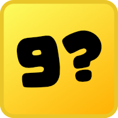
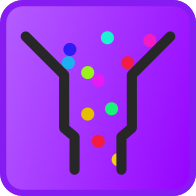
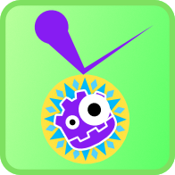

# Godot twitch games

Collection of small chat controlled games for [Twitch](https://twitch.tv/mreliptik).

🤖 Uses Godot [4.1.3](https://godotengine.org/download/archive/4.1.3-stable/)

## 🦺 Projects & descriptions

| Icon |  Game sources |  Project  | Description | Status |
:-----:|:-------:|:------:|:-----------:|:------:|
| [cannon](scenes/games/cannon) | [Cannon project](https://github.com/users/MrEliptik/projects/2/views/1) | Find the right angle and power to reach the target | WIP 🛠
| [numbermind](scenes/games/numbermind) | [No project yet]() | Guess the number | WIP 🛠
| [marble_race](scenes/games/marble_race) | [Marble project](https://github.com/users/MrEliptik/projects/1/views/1) | Marble race game | WIP 🛠
| [pool_royale](scenes/games/pool_royale) | [Pool royale project](https://github.com/users/MrEliptik/projects/8/views/1) | Pool style game where you must be the last one standing | WIP 🛠

## 👨‍💻 How to contribute

You can report bugs, fix issues, open proposals for new features and even make entire games if you wish!

- **🐛 Bugs**: Describe as best as you can what happened. Don't hesitate to include error messages and screenshots if relevant.

- **✨ New feature/idea**: Open an issue describing what you want and discuss it with others.

- **📝 Existing issue**: Comment it to let others know you're working on it!

- **🎮 New game**: Please open an issue before working on the game, to discuss the idea.
At the moment, there's no template to create new games, so you'll have to look at the existing games for inspiration. 
You can look at the [projects](https://github.com/MrEliptik/godot_twitch_games/projects?query=is%3Aopen) to see if a similar game exist already.

## 🤼 Contributors

Made possible by the amazing contributors 👇

## 📔 Licenses

This project is distributed under the MIT license, check [LICENSE](LICENSE).

## 🧰 Addons

- [GIFT](https://github.com/MennoMax/gift) - Godot IRC For Twitch addon
- [Box2D](https://github.com/lightspeedlucas/godot-box2d) - Box2D integration module for Godot

## ✌ About

If you enjoyed this project and want to support me:

**Get exlusive content and access to my game's source code**

**One time donation**

🔗 Links
- [Twitter](https://twitter.com/mreliptik)
- [Twitch](https://twitch.tv/mreliptik)
- [YouTube](https://www.youtube.com/c/MrEliptik)
- [Discord](https://discord.gg/83nFRPTP6t)
- [All links](https://bento.me/mreliptik)

## 🧰 Addons

- [GIFT](https://github.com/MennoMax/gift) - Godot IRC For Twitch addon
- [Box2D](https://github.com/lightspeedlucas/godot-box2d) - Box2D integration module for Godot

## 🛠️ Configuration

- [Configuration](configuration.md) - How to setup the project (Twitch etc.)
